# 1.
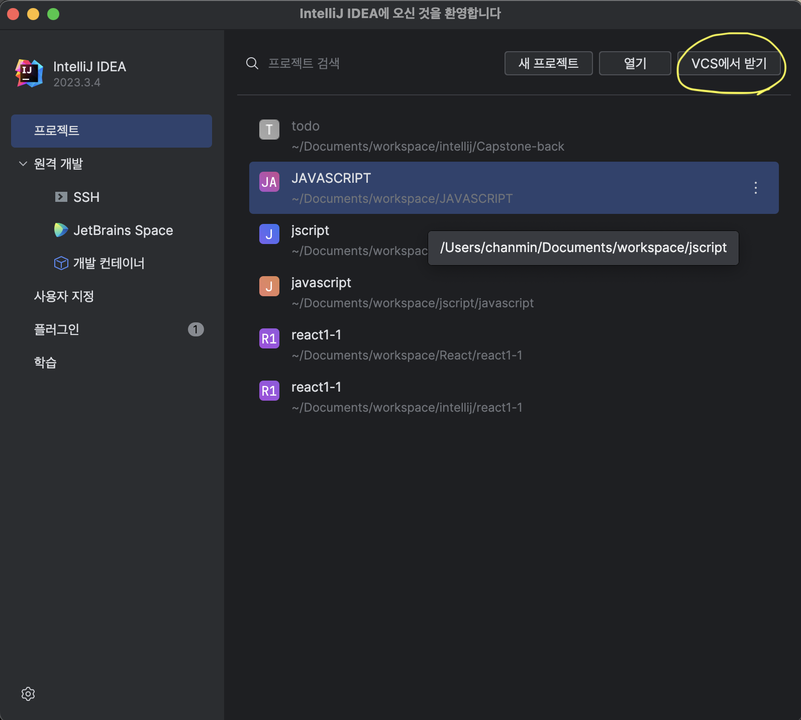

# 2.
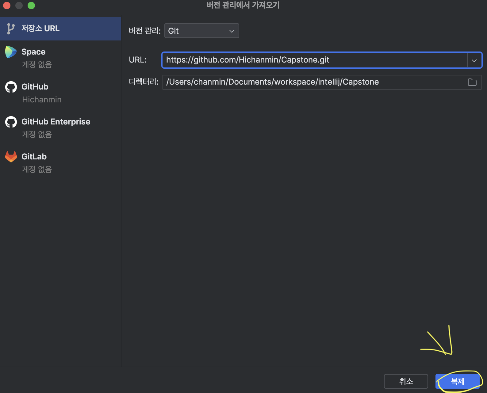

```https://github.com/Hichanmin/Capstone.git```
# 3. intellj 왼쪽 하단
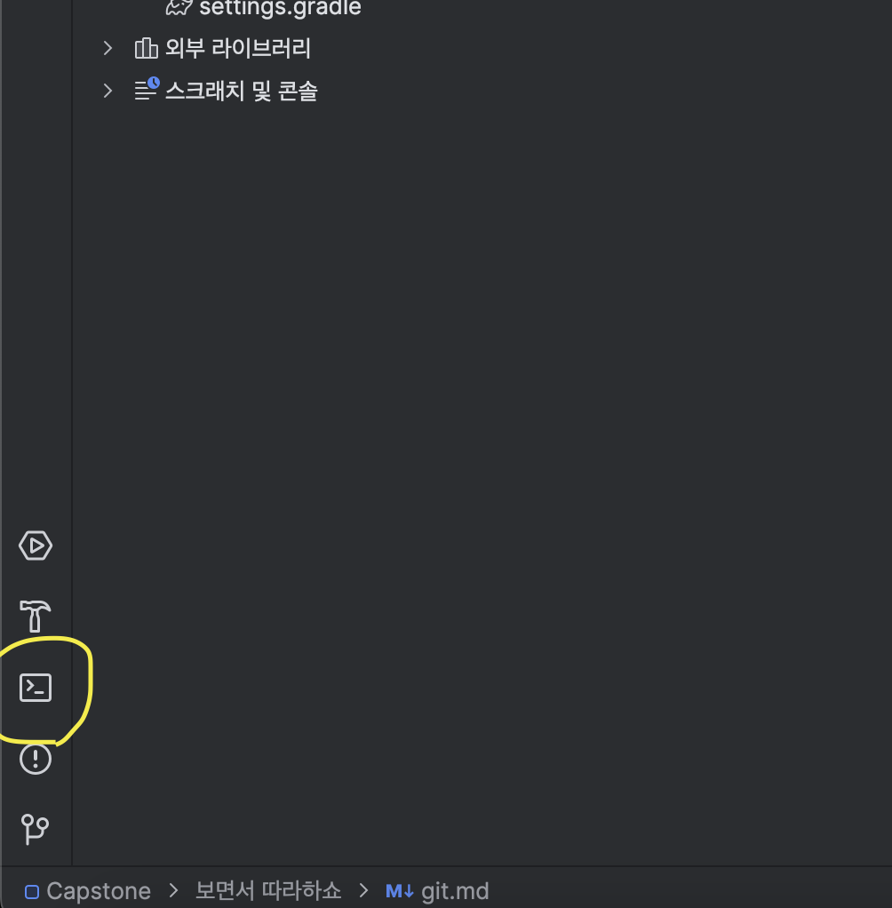
# 4. 
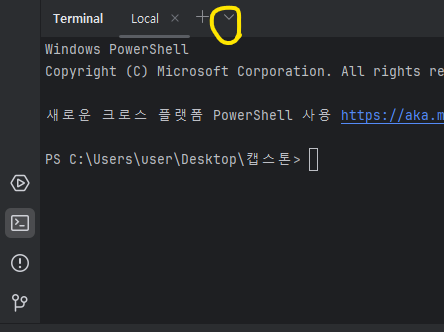
# 5.
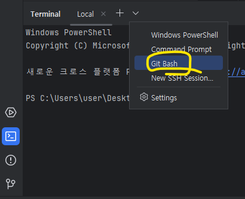
# 6. remote 연결 확인
### 원래 clone 해오면 자동으로 remote 연결 되는데 아래 사진처럼 안돼있으면 아래 복사해서 remote 연결하고  다시 ```git remote -v```로 연결 됐는지 확인하기
### ``` git remote add origin https://github.com/Hichanmin/Capstone.git ```
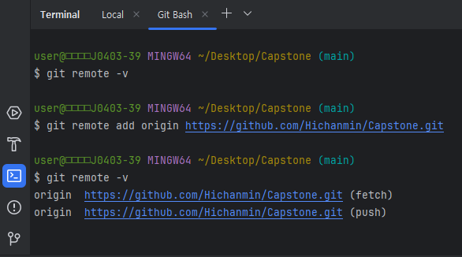
# 7. branch 만들고 checkout (중요!) 꼭 하세용
### 예시엔 Chanmin 으로 해놨는데 대충 편하신대로
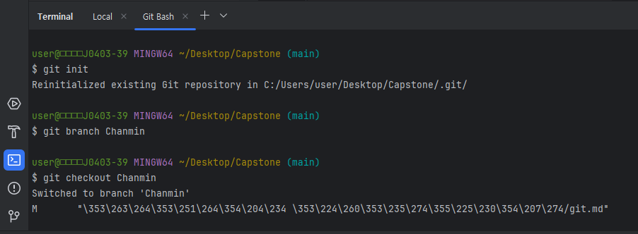
# 8. 예시처럼 바뀐지 확인
### 오른쪽 상단에 main 이면 클릭 한번 해보셈 바뀔거임 (인텔리제이 적용 느려서)
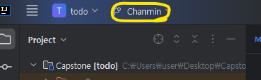
# 9. 열심히 코드 수정하기
### 인텔리제이 끄거나 컴터 끄거나 프로젝트 다시 열 때 항상 8번 처럼 내가 수정중이던 브랜치인지 확인하기
# 10. 코드 수정완료
### ```git add .```
### ```git commit -m "ex)controller 수정"``` 
### 여기서 config --global 오류가 뜬다면 아래 2줄 실행 (안뜨면 생략)
### ```git config --global user.name "username 입력"```
### ```git config --global user.email "user.email 입력"```
### 푸쉬하기
### ```git push origin 브랜치이름``` 7번에서 만들었던 브렌치이름
-만약 여기서  git 로그인 하라하면 하면됨
# 11. git 들어가서 브렌치 확인
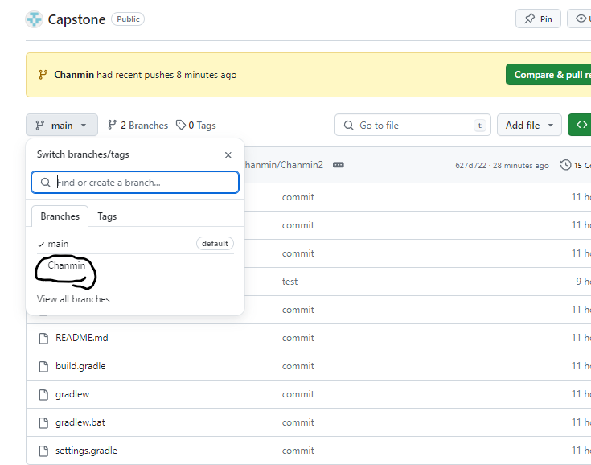
# 12. pull request
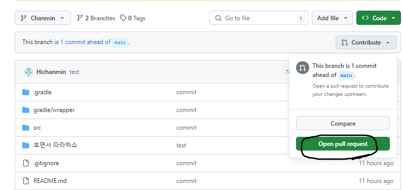
# 13.
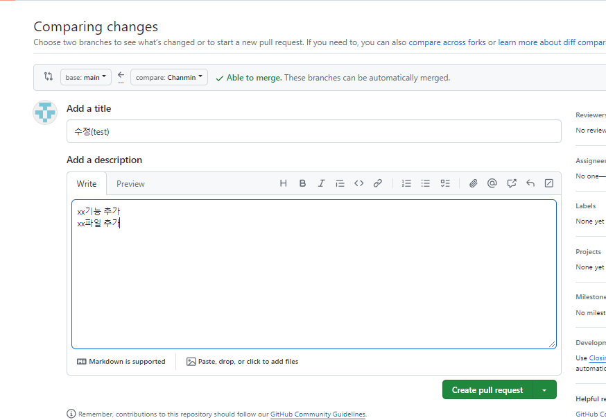
# 14.
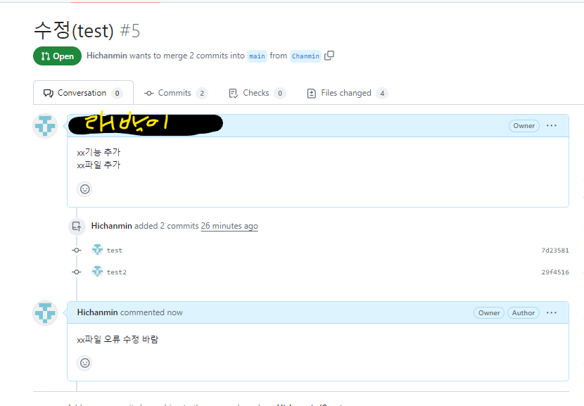
### 이러면 9번 부터 다시
# 15. 굳
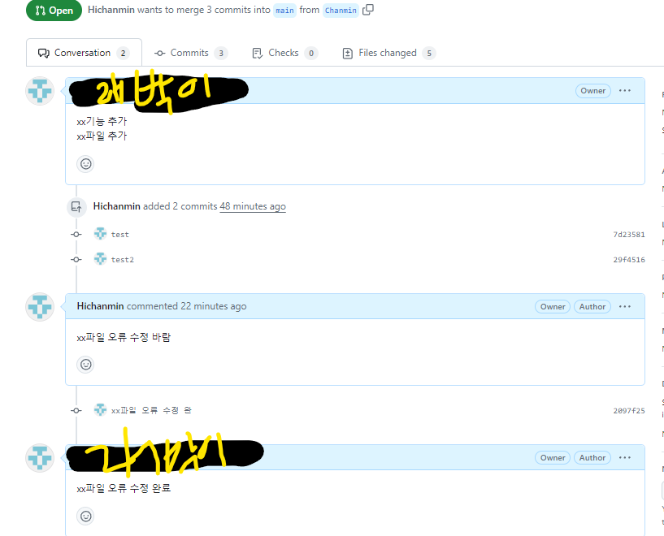
# 16. 
#### 여기까지 왔다면 지금까지 수정한 브렌치를 오류가 없다면 메인 브렌치에 merge(병합) 할겁니다
#### 그리고 나서 gitHub(원격)에 있는 수정한 브렌치를 삭제할겁니다
#### 여러분은 인텔리제이에서 메인 브렌치로 checkout 하시고 메인 브렌치를
```git checkout main```
#### pull 합니다. 그리고 나서
```git pull origin main```
#### 로컬에 있는 수정한 브렌치를 삭제하시면 됩니다.
```git branch -d 수정하던 브랜치 이름```

